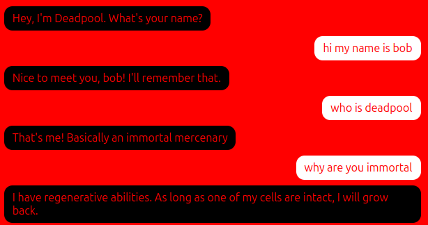
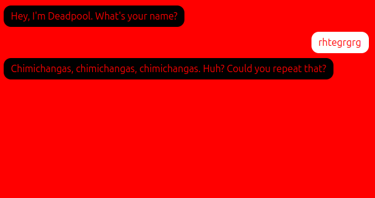

# poolchatter

Chatbot without an LLM. Meet **Deadpool** — a rule-based chatbot with memory, retrieval, and Markov babble, stdlib only.

## Files

- `bot.py` — all bot logic, no dependencies (`re`, `random`, `math`, `collections` only)
- `app.py` — `http.server`-based web server: serves `index.html` on `GET /`, JSON chat on `POST /api/chat` with per-session `PoolChatter` instances
- `index.html` — single-file chat UI (black/red Deadpool theme, message log, typing indicator, `fetch('/api/chat')`)
- `good.png` / `confused.png` — demo screenshots

## How it works

- **ELIZA-style regex core** (`bot.py:14-34`, 18 patterns): name capture (`my name is …`), age, pet/family names, `I like/love/hate…`, `I feel…`, `I'm worried about…`, `you are…`, jokes, weather, identity, hi/bye, help, thanks, yes/no. Random reply choice per pattern + I→you reflection via `REFLECT` / `reflect()`.
- **Memory** (`PoolChatter.reply()`): stores your name + pet/family names in `self.facts`, recalls on `what's my … name`. Personalizes ~15% of replies with your name.
- **Retrieval** (`Retrieval` class): tiny TF-IDF over 5 hand-written Deadpool Q→A pairs (`RETRIEVAL_PAIRS`: who is deadpool, invincible, regenerate, backstory, job). Fires only if score > 1.2.
- **Markov chain** (`Markov`, order-3): trained on 5 hand-written lines (`CORPUS_LINES` — hand regen, Juggernaut, T-Rex…). Fires ~35% of the time when nothing matches, prefixed with `That reminds me - …`.
- **Fallbacks**: 7 Deadpool lines (`FALLBACKS`) + 3 follow-ups (`FOLLOWUPS`), occasionally appended with your name.
- **Server** (`app.py`): in-memory `SESSIONS` dict keyed by client `session` id, random seed per session. Fake typing delay `0.4s + 20ms/char` (max 2s). Client shows “Deadpool thinking of some random controversial nonsense…”.

Training data: all hand-written in `bot.py`. No external data, no chat logs, no LLM anywhere.

## Run

```bash
python3 app.py 8080   # then open http://localhost:8080
```

CLI: `python3 -c "from bot import PoolChatter; b=PoolChatter(); print(b.reply('hi'))"`

## Transcripts

Good run:



Confused run:


